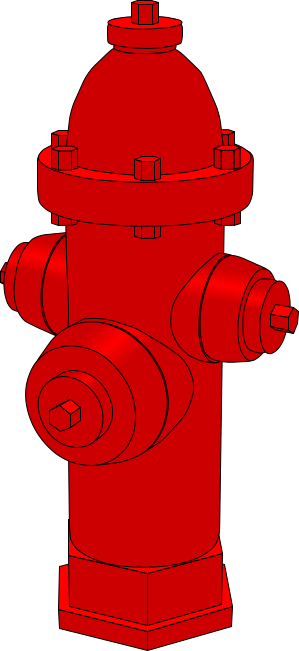

# Hydrant
FHIR templating engine for hydration, dehydration and profile generation.
<p align="center">
    
</p>

[FHIR](https://fhir.org/) allows for health data interoperability.
But health data is such a vast domain so the FHIR spec needs to cover the breadth of possible health data, which adds complexity.
In a specific company, or application or service, you probably don't need the full generality of FHIR.

_Hydrant_ allows separating the FHIR models useful for interoperability from a simpler _dehydrated_ model (which we call **dfhir**) that can be used for specific applications.
You can create your models as [templates](https://github.com/babylonhealth/fhir-hydrant/blob/main/docs/templates.md)
with which Hydrant can take the simple dfhir model and hydrate it into full FHIR.
What is more - Hydrant can generate [fhir profiles](https://build.fhir.org/profiling.html) for the output FHIR schema for you.
This would not be possible with a more general templating engine.
The template models also give you a schema for your dfhir, compatible with formats like protobuf.
See [this talk](https://www.youtube.com/watch?v=nD8DI6Years) for more motivation.

---

### Quick Start

Hydrant is (almost) published to Maven Central. You can add the following to your build
```
TODO sbt core dependency
```

Here is a basic example of hydration:
```scala
import com.emed.hydrant.{Definitions, Hydration}
import io.circe.parser.parse

val templateString =
  """
      {
        "id": "BodyWeight",
        "name": "Body weight",
        "domain": "example",
        "description": "A body weight measurement in lbs",
        "params": {
          "patientId": {"type": "uuid", "description": "patient id"},
          "value": {"type": "integer", "description": "body weight in lbs"}
        },
        "hydrated": {
          "resourceType": "Observation",
          "status": "final",
          "code": {
            "coding": [
              {
                "system": "http://snomed.info/sct",
                "code": "27113001"
              }
            ]
          },
          "subject": {
            "reference": "Patient/{{{patientId}}}"
          },
          "valueQuantity": {
            "value": "{{{value}}}",
            "unit": "lbs",
            "system": "http://unitsofmeasure.org",
            "code": "[lb_av]"
          }
        }
      }
    """

val definitions = Definitions.decode(templateString) // The collection of all hydration definitions
val hydration = Hydration(definitions) // Hydration class

val dfhir = parse(
  """
    {
      "patientId": "123e4567-e89b-12d3-a456-426614174000",
      "value": 150
    }
  """
).toTry.get

val template = definitions("BodyWeight").toOption.flatMap(_.asTemplate).get // The template we will use to hydrate

val fhir = hydration.hydrateUnsafe(template, dfhir) // Hydrate dfhir using template

println(fhir)
```

---

### Templates
Hydrant uses template files to define mappings from dehydrated FHIR (dfhir) to FHIR resources.

There are three main types:
- Templates
- Enumerations
- Child Templates

Collectively we call these Hydration Definitions.
For more details on how to write these definitions see [template documentation](https://github.com/babylonhealth/fhir-hydrant/blob/main/docs/templates.md)
See also these [examples of templates](https://github.com/babylonhealth/fhir-hydrant/tree/main/core/src/test/resources/template) that are used in the tests.

---

### Loading Hydration Definitions

Before we can do anything else, we need to load all of our hydration definitions.
This is because a hydration definition may refer to other definitions, so we need to know about all possible definitions up front.
For this we use the `Definitions` class.  

There are various methods we can use to construct your `Definitions` class.
If you have a `templates` folder in your `resources` containing all of your definitions, you may simply use:
```scala
val definitions = Definitions.fromClassPath()
```
Otherwise you can point to a local file with `Definitions.decode(file)`.
Definitions can be combined using `++` and have a cats monoid instance defined.
Individual hydration definitions can be summoned by id as follows:
```scala
val definition = definitions("id")
```
This returns an `Either`, with an error when the definition could not be found.

---

### Hydration

Hydration is the process of filling in a template. Taking _dehydrated FHIR_ (or _dfhir_ for short) and turning it into FHIR.
For this, we require the `Hydration` class. You can initialise it with your definitions:
```scala
val hydration = Hydration(definitions)
```
Then given a `Template` and some dfhir (`io.circe.Json`), we can hydrate the dfhir using the template:
```scala
val dfhir: Json = ???
val template: Template = ???
hydration.hydrateJson(template)(dfhir)
```
This returns an `Either` containing an error when something went wrong or a `io.circe.Json` on success.
If you want to throw the error instead, you can use:
```scala
hydration.hydrateUnsafe(template, dfhir)
```
See the [advanced hydration options](https://github.com/babylonhealth/fhir-hydrant/blob/main/docs/hydration.md) docs.

---

### Dehydration
Dehydration is the reverse of hydration. We take a FHIR json and pattern match against a template to give dfhir.
Deydration requires the `Dehydration` class. Again, you can initialise it with your definitions:
```scala
val dehydration = Deydration(definitions)
```
Similarly to hydration, given a `Template` and some FHIR (`io.circe.Json`), we can dehydrate the FHIR using the template:
```scala
val fhir: Json = ???
val template: Template = ???
dehydration.dehydrate(template)(fhir)
```
This returns an `Either` containing an error when something went wrong or a `io.circe.Json` on success.
If you want to throw the error instead, you can use:
```scala
dehydration.dehydrateUnsafe(template, dfhir)
```
See the [advanced dehydration options](https://github.com/babylonhealth/fhir-hydrant/blob/main/docs/dehydration.md) docs.

---

### FHIR Conformance Resource (Profile) Generation
Templates give us the types and cardinalities of input dfhir, as well as the shape of the output FHIR.
So we can work out the range of possible values of our hydrated FHIR and describe it using a FHIR profile.
Enums can also give us value sets and if we have included any extensions we know a bit about those too so we can generate an extension definition.

Profile generation uses [Lit](https://github.com/babylonhealth/lit-fhir) so is in a separate module.
```
TODO sbt dependency
```

The simplest way of writing conformance resources to files is:
```scala
val profileGen = ProfileGen(definitions, "http://example.com")
val conformanceResources = profileGen.makeAllProfilesAndValueSets()
conformanceResources.foreach(_.write())
```

This will write the files to folders:
```
./valueSets/
./profiles/
./extensions/
```
See the [advanced profile generation options](https://github.com/babylonhealth/fhir-hydrant/blob/main/docs/profilegen.md) docs.

---

## Coming soon
- Protobuf dfhir schema generation
- Command line interface
- Java wrappers